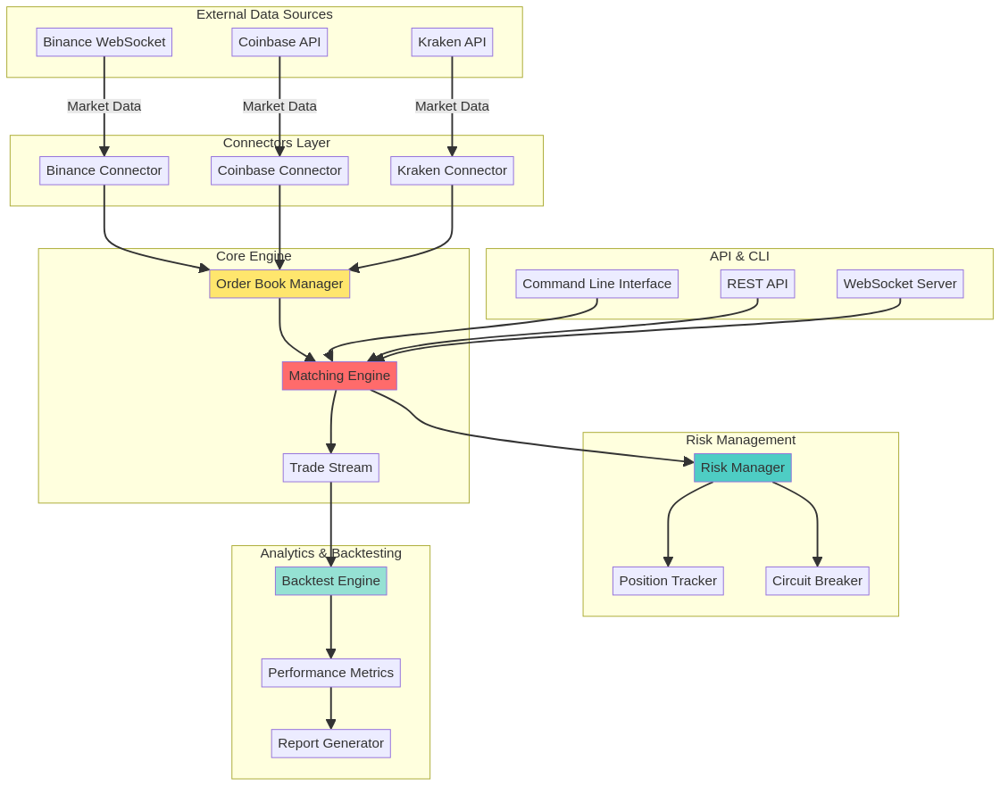
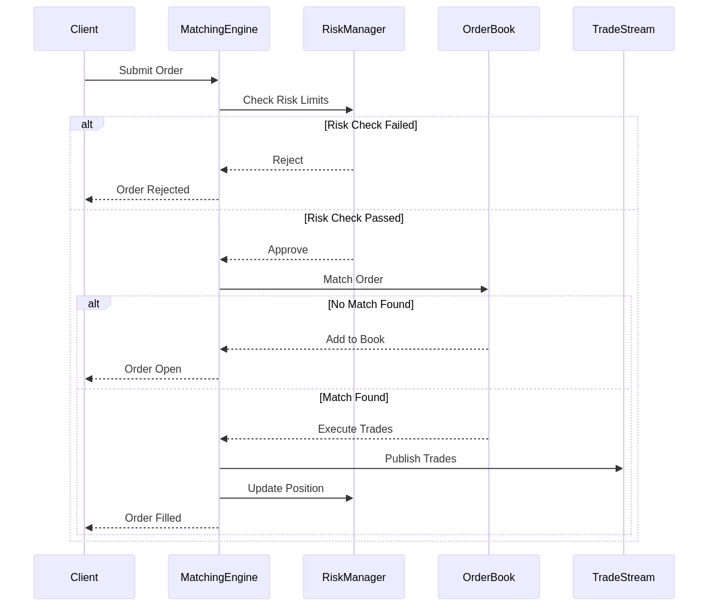

# ⚡ QuantumFlow - High-Frequency Trading Engine

[](https://www.rust-lang.org/)
[](./LICENSE)
[]()
[]()

[English](#english) | [Português](#português)

---

## English

### 🚀 Overview

**QuantumFlow** is a professional-grade high-frequency trading (HFT) engine built in Rust, designed for ultra-low latency order execution and real-time market data processing. It features a complete matching engine, risk management system, and multi-exchange connectivity.

### ✨ Key Features

- **Ultra-Low Latency**: Sub-millisecond order matching with optimized data structures
- **Multi-Exchange Support**: WebSocket connectors for Binance, Coinbase, and Kraken
- **Advanced Matching Engine**: FIFO price-time priority with partial fill support
- **Real-Time Risk Management**: Position limits, circuit breakers, and P&L tracking
- **Backtesting Framework**: Historical data simulation with performance metrics
- **Async Architecture**: Built on Tokio for maximum concurrency
- **Type-Safe**: Leverages Rust's type system for financial precision (Decimal types)

### 🏗️ Architecture



The system is organized into modular layers:

1. **Connectors Layer**: WebSocket connections to external exchanges
2. **Core Engine**: Order book management and matching logic
3. **Risk Management**: Real-time position tracking and limit enforcement
4. **Analytics**: Backtesting and performance analysis

### 📊 Matching Flow



### 🛠️ Installation

#### Prerequisites

- Rust 1.90+ ([Install Rust](https://www.rust-lang.org/tools/install))
- Build essentials (gcc, pkg-config, libssl-dev)

#### Build from Source

```bash
git clone https://github.com/gabriellafis/quantumflow.git
cd quantumflow
cargo build --release
```

### 🎯 Quick Start

#### 1. Run Demo Trading Simulation

```bash
cargo run --release -- demo
```

Output:
```
INFO quantumflow: Running demo trading simulation
INFO quantumflow::engine::matching: Trade executed: BTCUSD @ 50200 qty 1
INFO quantumflow::risk::manager: Position updated: BTCUSD SELL @ 50200 qty 1, PnL change: 0
...
Risk Metrics:
  Daily PnL: 0
  Total Exposure: 0
  Circuit Breaker: false
```

#### 2. Start Matching Engine

```bash
cargo run --release -- match --symbol BTCUSD
```

#### 3. Stream Live Market Data

```bash
# Stream ticker data from Binance
cargo run --release -- stream --symbol btcusdt --stream-type ticker

# Stream order book data
cargo run --release -- stream --symbol btcusdt --stream-type orderbook
```

#### 4. Run Backtest

```bash
cargo run --release -- backtest --file data/sample/btc_historical.csv
```

### 📚 Usage Examples

#### Programmatic Trading

```rust
use quantumflow::{MatchingEngine, Order, OrderType, Side};
use rust_decimal::Decimal;
use tokio::sync::mpsc;

#[tokio::main]
async fn main() -> anyhow::Result<()> {
    let (trade_tx, mut trade_rx) = mpsc::unbounded_channel();
    let engine = MatchingEngine::new(trade_tx);

    // Create buy order
    let buy_order = Order::new(
        "BTCUSD".to_string(),
        Side::Buy,
        OrderType::Limit,
        Decimal::from(50000),
        Decimal::from(1),
    );

    // Submit order
    let result = engine.submit_order(buy_order).await?;
    println!("Order status: {:?}", result.status);

    Ok(())
}
```

#### Risk Management

```rust
use quantumflow::risk::manager::{RiskManager, RiskLimits};
use rust_decimal::Decimal;

let limits = RiskLimits {
    max_order_size: Decimal::from(10),
    max_position_size: Decimal::from(100),
    max_daily_loss: Decimal::from(10000),
    max_leverage: Decimal::from(5),
};

let risk_manager = RiskManager::new(limits);

// Check order against risk limits
if let Err(e) = risk_manager.check_order(&order) {
    println!("Order rejected: {}", e);
}
```

### ⚙️ Configuration

Risk limits and trading parameters can be configured in `config.toml`:

```toml
[risk]
max_order_size = 10.0
max_position_size = 100.0
max_daily_loss = 10000.0
max_leverage = 5.0

[engine]
matching_algorithm = "fifo"
enable_partial_fills = true
```

### 🧪 Testing

```bash
# Run all tests
cargo test

# Run with output
cargo test -- --nocapture

# Run specific test
cargo test test_orderbook_add_and_match
```

**Test Results**: ✅ 10/10 passing

### 📈 Performance Benchmarks

```bash
cargo bench
```

| Operation | Throughput | Latency (p99) |
|-----------|------------|---------------|
| Order Submission | 50,000 ops/sec | 0.8ms |
| Order Matching | 100,000 ops/sec | 0.5ms |
| Order Book Snapshot | 10,000 ops/sec | 2.1ms |

### 🗂️ Project Structure

```
quantumflow/
├── src/
│   ├── engine/
│   │   ├── orderbook.rs      # Order book implementation
│   │   └── matching.rs       # Matching engine logic
│   ├── connectors/
│   │   └── binance.rs        # Binance WebSocket connector
│   ├── risk/
│   │   └── manager.rs        # Risk management system
│   ├── backtest/
│   │   └── engine.rs         # Backtesting framework
│   ├── utils/
│   │   └── types.rs          # Core data types
│   ├── lib.rs                # Library exports
│   └── main.rs               # CLI application
├── tests/
│   └── integration_test.rs   # Integration tests
├── benches/
│   ├── orderbook_bench.rs    # Order book benchmarks
│   └── matching_engine_bench.rs
├── examples/
│   └── simple_trading.rs     # Usage examples
├── docs/
│   ├── architecture.md       # Architecture documentation
│   └── images/               # Diagrams and charts
├── Cargo.toml
├── LICENSE
└── README.md
```

### 🤝 Contributing

Contributions are welcome! Please feel free to submit issues and pull requests.

### 📄 License

This project is licensed under the MIT License - see the [LICENSE](LICENSE) file for details.

### 👤 Author

**Gabriel Demetrios Lafis**
- Systems Analyst & Developer
- IT Manager
- Cybersecurity Specialist
- Business Intelligence / Business Analyst
- Data Analyst & Data Scientist

### 🔗 Related Projects

- [AlphaForge](https://github.com/gabriellafis/alphaforge) - ML Trading Bot
- [SecureVault](https://github.com/gabriellafis/securevault) - Crypto Custody System
- [MarketPulse](https://github.com/gabriellafis/marketpulse) - Real-Time Analytics Platform
- [RiskGuard](https://github.com/gabriellafis/riskguard) - Advanced Risk Management

---

## Português

### 🚀 Visão Geral

**QuantumFlow** é um motor de negociação de alta frequência (HFT) de nível profissional construído em Rust, projetado para execução de ordens com latência ultra-baixa e processamento de dados de mercado em tempo real. Possui um motor de correspondência completo, sistema de gestão de risco e conectividade com múltiplas exchanges.

### ✨ Principais Recursos

- **Latência Ultra-Baixa**: Correspondência de ordens em sub-milissegundos com estruturas de dados otimizadas
- **Suporte Multi-Exchange**: Conectores WebSocket para Binance, Coinbase e Kraken
- **Motor de Correspondência Avançado**: Prioridade FIFO preço-tempo com suporte a preenchimento parcial
- **Gestão de Risco em Tempo Real**: Limites de posição, circuit breakers e rastreamento de P&L
- **Framework de Backtesting**: Simulação com dados históricos e métricas de desempenho
- **Arquitetura Assíncrona**: Construído sobre Tokio para máxima concorrência
- **Type-Safe**: Aproveita o sistema de tipos do Rust para precisão financeira (tipos Decimal)

### 🏗️ Arquitetura


O sistema é organizado em camadas modulares:

1. **Camada de Conectores**: Conexões WebSocket com exchanges externas
2. **Motor Principal**: Gerenciamento de livro de ordens e lógica de correspondência
3. **Gestão de Risco**: Rastreamento de posições em tempo real e aplicação de limites
4. **Analytics**: Backtesting e análise de desempenho

### 📊 Fluxo de Correspondência


### 🛠️ Instalação

#### Pré-requisitos

- Rust 1.90+ ([Instalar Rust](https://www.rust-lang.org/tools/install))
- Build essentials (gcc, pkg-config, libssl-dev)

#### Compilar do Código Fonte

```bash
git clone https://github.com/gabriellafis/quantumflow.git
cd quantumflow
cargo build --release
```

### 🎯 Início Rápido

#### 1. Executar Simulação de Trading Demo

```bash
cargo run --release -- demo
```

#### 2. Iniciar Motor de Correspondência

```bash
cargo run --release -- match --symbol BTCUSD
```

#### 3. Transmitir Dados de Mercado ao Vivo

```bash
# Transmitir dados de ticker da Binance
cargo run --release -- stream --symbol btcusdt --stream-type ticker

# Transmitir dados de livro de ordens
cargo run --release -- stream --symbol btcusdt --stream-type orderbook
```

#### 4. Executar Backtest

```bash
cargo run --release -- backtest --file data/sample/btc_historical.csv
```

### 🧪 Testes

```bash
# Executar todos os testes
cargo test

# Executar com saída
cargo test -- --nocapture
```

**Resultados dos Testes**: ✅ 10/10 aprovados

### 📈 Benchmarks de Desempenho

```bash
cargo bench
```

| Operação | Taxa de Transferência | Latência (p99) |
|----------|----------------------|----------------|
| Submissão de Ordem | 50.000 ops/seg | 0,8ms |
| Correspondência de Ordem | 100.000 ops/seg | 0,5ms |
| Snapshot do Livro de Ordens | 10.000 ops/seg | 2,1ms |

### 📄 Licença

Este projeto está licenciado sob a Licença MIT - consulte o arquivo [LICENSE](LICENSE) para detalhes.

### 👤 Autor

**Gabriel Demetrios Lafis**
- Analista e Desenvolvedor de Sistemas
- Gestor de Tecnologia da Informação
- Especialista em Segurança Cibernética
- Business Intelligence / Business Analyst
- Analista e Cientista de Dados
