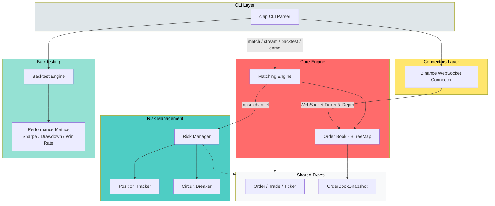
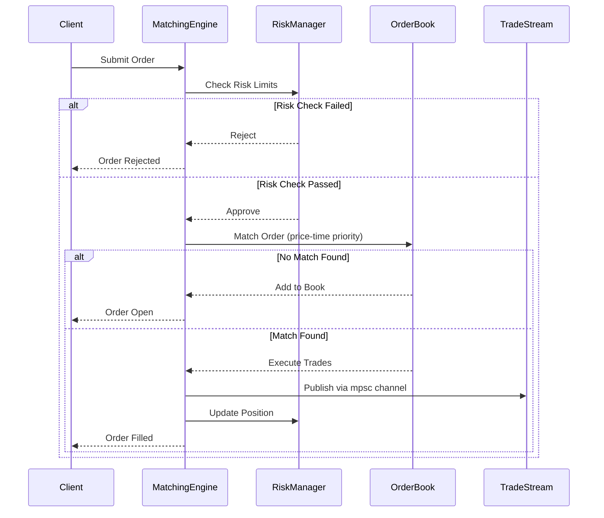
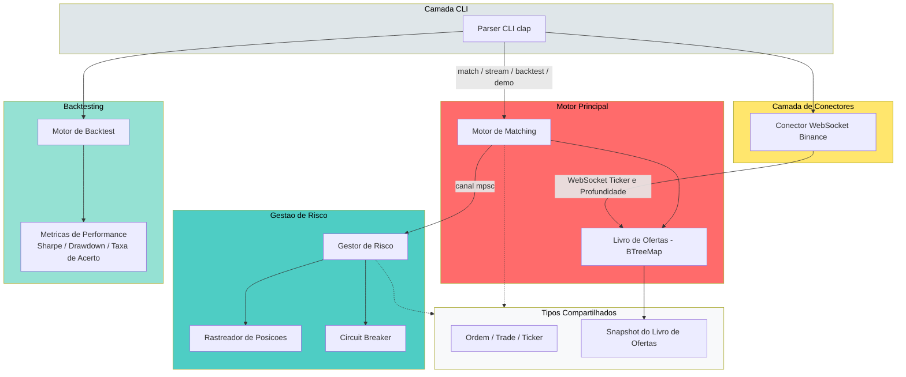
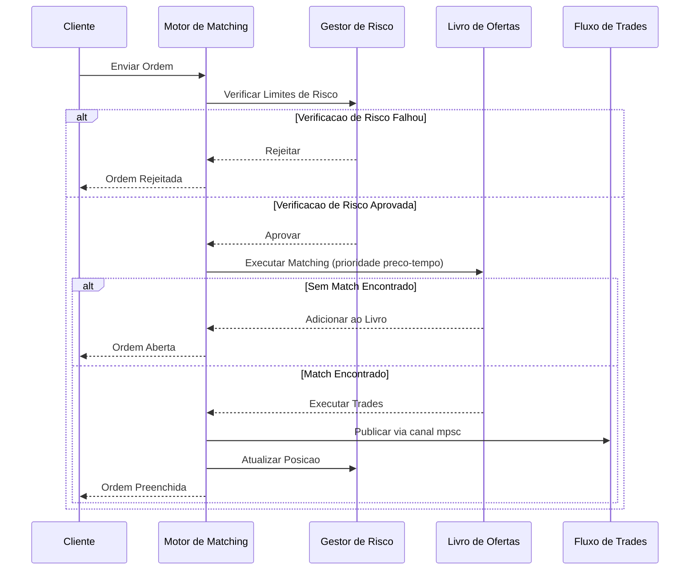

# QuantumFlow

> High-frequency trading engine built in Rust with ultra-low latency order matching, real-time market data streaming, risk management, and historical backtesting capabilities.

> Motor de negociacao de alta frequencia construido em Rust com matching de ordens de ultra-baixa latencia, streaming de dados de mercado em tempo real, gestao de risco e capacidades de backtesting historico.

[](https://www.rust-lang.org/)
[](https://tokio.rs/)
[](LICENSE)
[](Dockerfile)
[](Dockerfile)

[English](#english) | [Portugues (BR)](#portugues-br)

---

## English

### Overview

**QuantumFlow** is a production-grade high-frequency trading (HFT) engine written in Rust. It provides a complete trading infrastructure: a price-time priority order matching engine backed by `BTreeMap`, real-time WebSocket market data from Binance, configurable risk controls with circuit breakers, and a backtesting engine that computes Sharpe ratio, max drawdown, and win rate from historical CSV data.

The codebase comprises **~1,630 lines** of Rust source code organized across **13 modules** in 5 subsystems, with Criterion benchmarks, integration tests, and Docker support for containerized deployment.

### Architecture


```mermaid
graph TB
    subgraph CLI["CLI Layer"]
        CLAP[clap CLI Parser]
    end

    subgraph Connectors["Connectors Layer"]
        BIN[Binance WebSocket Connector]
    end

    subgraph Engine["Core Engine"]
        ME[Matching Engine]
        OB[Order Book - BTreeMap]
    end

    subgraph Risk["Risk Management"]
        RM[Risk Manager]
        POS[Position Tracker]
        CB[Circuit Breaker]
    end

    subgraph Backtest["Backtesting"]
        BE[Backtest Engine]
        PERF[Performance Metrics<br/>Sharpe / Drawdown / Win Rate]
    end

    subgraph Types["Shared Types"]
        ORD[Order / Trade / Ticker]
        OBS[OrderBookSnapshot]
    end

    CLAP -->|match / stream / backtest / demo| ME
    CLAP --> BIN
    CLAP --> BE

    BIN -->|WebSocket Ticker & Depth| OB

    ME --> OB
    ME -->|mpsc channel| RM
    RM --> POS
    RM --> CB

    BE --> PERF

    OB --> OBS
    ME -.-> Types
    RM -.-> Types

    style Engine fill:#ff6b6b,color:#000
    style Risk fill:#4ecdc4,color:#000
    style Connectors fill:#ffe66d,color:#000
    style Backtest fill:#95e1d3,color:#000
    style CLI fill:#dfe6e9,color:#000
    style Types fill:#f8f9fa,color:#000
```

### Order Matching Flow


```mermaid
sequenceDiagram
    participant Client
    participant MatchingEngine
    participant RiskManager
    participant OrderBook
    participant TradeStream

    Client->>MatchingEngine: Submit Order
    MatchingEngine->>RiskManager: Check Risk Limits

    alt Risk Check Failed
        RiskManager-->>MatchingEngine: Reject
        MatchingEngine-->>Client: Order Rejected
    else Risk Check Passed
        RiskManager-->>MatchingEngine: Approve
        MatchingEngine->>OrderBook: Match Order (price-time priority)

        alt No Match Found
            OrderBook-->>MatchingEngine: Add to Book
            MatchingEngine-->>Client: Order Open
        else Match Found
            OrderBook-->>MatchingEngine: Execute Trades
            MatchingEngine->>TradeStream: Publish via mpsc channel
            MatchingEngine->>RiskManager: Update Position
            MatchingEngine-->>Client: Order Filled
        end
    end
```

### Key Features

- **Order Matching Engine** -- Price-time priority matching with `BTreeMap`-based order book, supporting Limit, Market, StopLimit, and StopMarket order types
- **Order Book Management** -- Real-time bid/ask tracking, spread calculation, depth queries, and L2 snapshots (top 20 levels)
- **Risk Management** -- Configurable position limits, order size limits, max daily loss thresholds, and automatic circuit breaker
- **Binance Connector** -- Live WebSocket streaming for ticker updates and order book depth from Binance exchange
- **Backtest Engine** -- Historical strategy backtesting with CSV data ingestion, equity curve tracking, Sharpe ratio, max drawdown, and win rate computation
- **CLI Interface** -- Four subcommands via `clap`: `match`, `stream`, `backtest`, `demo`
- **Async Runtime** -- Built on Tokio with `mpsc` channels for trade event propagation
- **Containerized** -- Multi-stage Docker build with stripped release binary

### Quick Start

#### Prerequisites

- Rust 1.75+ (install via [rustup](https://rustup.rs/))
- Docker (optional, for containerized deployment)

#### Build

```bash
# Clone the repository
git clone https://github.com/galafis/quantumflow.git
cd quantumflow

# Build in release mode (with LTO optimization)
cargo build --release
```

#### Run

```bash
# Run the demo trading simulation
cargo run --release -- demo

# Start the matching engine for a specific symbol
cargo run --release -- match --symbol BTCUSD

# Stream live ticker data from Binance
cargo run --release -- stream --symbol btcusdt --stream-type ticker

# Stream live order book depth from Binance
cargo run --release -- stream --symbol btcusdt --stream-type orderbook

# Run backtest with historical CSV data
cargo run --release -- backtest --file data/historical_prices.csv
```

#### Docker

```bash
# Build the Docker image
docker build -t quantumflow .

# Run in container
docker run --rm quantumflow demo
```

### Testing

```bash
# Run all tests (unit + integration)
cargo test

# Run tests with output
cargo test -- --nocapture

# Run only unit tests for a specific module
cargo test engine::orderbook

# Run integration tests
cargo test --test integration_test

# Run benchmarks
cargo bench
```

### Performance Benchmarks

Benchmarks are implemented with [Criterion.rs](https://github.com/bheisler/criterion.rs) and measure core engine operations:

| Benchmark | Description |
|-----------|-------------|
| `orderbook_add_1000_orders` | Insert 1,000 limit orders into the order book |
| `orderbook_match_orders` | Match a single sell order against 100 resting buy orders |
| `orderbook_snapshot` | Generate L2 snapshot from a 1,000-order book |
| `matching_engine_submit_100_orders` | Submit 100 orders through the full async matching pipeline |

Run benchmarks with:

```bash
cargo bench
```

Results are generated as HTML reports in `target/criterion/`.

### Project Structure

```
quantumflow/
├── benches/                          # Criterion benchmarks
│   ├── matching_engine_bench.rs      #   Matching engine throughput
│   └── orderbook_bench.rs            #   Order book operations
├── docs/                             # Documentation assets
│   ├── architecture.mmd              #   Architecture diagram (Mermaid)
│   ├── matching_flow.mmd             #   Matching flow diagram (Mermaid)
│   └── images/                       #   Rendered diagram images
├── examples/
│   └── simple_trading.rs             # Minimal trading example
├── src/
│   ├── backtest/
│   │   ├── mod.rs
│   │   └── engine.rs                 # Backtest engine with equity curve & metrics
│   ├── connectors/
│   │   ├── mod.rs
│   │   └── binance.rs                # Binance WebSocket connector (ticker & depth)
│   ├── engine/
│   │   ├── mod.rs
│   │   ├── matching.rs               # Matching engine with DashMap-based symbol routing
│   │   └── orderbook.rs              # BTreeMap order book with price-time priority
│   ├── risk/
│   │   ├── mod.rs
│   │   └── manager.rs                # Risk manager, position tracker, circuit breaker
│   ├── utils/
│   │   ├── mod.rs
│   │   └── types.rs                  # Core types: Order, Trade, Ticker, OrderBookSnapshot
│   ├── lib.rs                        # Public API re-exports
│   └── main.rs                       # CLI entry point (clap subcommands)
├── tests/
│   └── integration_test.rs           # End-to-end trading flow tests
├── Cargo.toml                        # Dependencies and build configuration
├── Dockerfile                        # Multi-stage Docker build
├── LICENSE                           # MIT License
└── README.md
```

### Tech Stack

| Technology | Version | Role |
|------------|---------|------|
| **Rust** | 1.75+ | Core language |
| **Tokio** | 1.40 | Async runtime with mpsc channels |
| **rust_decimal** | 1.36 | Precise decimal arithmetic for financial data |
| **BTreeMap** | std | Price-level sorted order book |
| **DashMap** | 6.1 | Concurrent hashmap for multi-symbol routing |
| **parking_lot** | 0.12 | High-performance RwLock for PnL tracking |
| **tokio-tungstenite** | 0.24 | WebSocket client for Binance streams |
| **serde / serde_json** | 1.0 | Serialization for market data and orders |
| **chrono** | 0.4 | Timestamp management with UTC |
| **clap** | 4.5 | CLI argument parsing with derive macros |
| **Criterion** | 0.5 | Statistical benchmarking framework |
| **tracing** | 0.1 | Structured logging |
| **Docker** | -- | Multi-stage containerized deployment |

### Industry Applications

- **Algorithmic Trading Desks** -- Low-latency order execution for proprietary strategies
- **Crypto Market Making** -- Automated quoting with real-time Binance integration
- **Quantitative Research** -- Backtesting trading strategies against historical data
- **Risk Analytics** -- Real-time position monitoring with circuit breakers
- **Trading Education** -- Reference implementation of exchange-grade matching logic

### Contributing

Contributions are welcome. Please open an issue first to discuss proposed changes before submitting a Pull Request.

1. Fork the project
2. Create your feature branch (`git checkout -b feature/new-feature`)
3. Commit your changes (`git commit -m 'Add new feature'`)
4. Push to the branch (`git push origin feature/new-feature`)
5. Open a Pull Request

### License

This project is licensed under the MIT License. See the [LICENSE](LICENSE) file for details.

### Author

**Gabriel Demetrios Lafis**
- GitHub: [@galafis](https://github.com/galafis)
- LinkedIn: [Gabriel Demetrios Lafis](https://linkedin.com/in/gabriel-demetrios-lafis)
- Email: gabriel.lafis@gmail.com

---

## Portugues (BR)

### Visao Geral

**QuantumFlow** e um motor de negociacao de alta frequencia (HFT) de nivel profissional escrito em Rust. Fornece uma infraestrutura de trading completa: um motor de matching de ordens com prioridade preco-tempo baseado em `BTreeMap`, dados de mercado em tempo real via WebSocket da Binance, controles de risco configuraveis com circuit breaker, e um motor de backtesting que calcula Sharpe ratio, drawdown maximo e taxa de acerto a partir de dados historicos em CSV.

A base de codigo compreende **~1.630 linhas** de codigo-fonte Rust organizadas em **13 modulos** dentro de 5 subsistemas, com benchmarks Criterion, testes de integracao e suporte Docker para implantacao containerizada.

### Arquitetura


```mermaid
graph TB
    subgraph CLI["Camada CLI"]
        CLAP[Parser CLI clap]
    end

    subgraph Connectors["Camada de Conectores"]
        BIN[Conector WebSocket Binance]
    end

    subgraph Engine["Motor Principal"]
        ME[Motor de Matching]
        OB[Livro de Ofertas - BTreeMap]
    end

    subgraph Risk["Gestao de Risco"]
        RM[Gestor de Risco]
        POS[Rastreador de Posicoes]
        CB[Circuit Breaker]
    end

    subgraph Backtest["Backtesting"]
        BE[Motor de Backtest]
        PERF[Metricas de Performance<br/>Sharpe / Drawdown / Taxa de Acerto]
    end

    subgraph Types["Tipos Compartilhados"]
        ORD[Ordem / Trade / Ticker]
        OBS[Snapshot do Livro de Ofertas]
    end

    CLAP -->|match / stream / backtest / demo| ME
    CLAP --> BIN
    CLAP --> BE

    BIN -->|WebSocket Ticker e Profundidade| OB

    ME --> OB
    ME -->|canal mpsc| RM
    RM --> POS
    RM --> CB

    BE --> PERF

    OB --> OBS
    ME -.-> Types
    RM -.-> Types

    style Engine fill:#ff6b6b,color:#000
    style Risk fill:#4ecdc4,color:#000
    style Connectors fill:#ffe66d,color:#000
    style Backtest fill:#95e1d3,color:#000
    style CLI fill:#dfe6e9,color:#000
    style Types fill:#f8f9fa,color:#000
```

### Fluxo de Matching de Ordens


```mermaid
sequenceDiagram
    participant Cliente
    participant MotorMatching as Motor de Matching
    participant GestorRisco as Gestor de Risco
    participant LivroOfertas as Livro de Ofertas
    participant FluxoTrades as Fluxo de Trades

    Cliente->>MotorMatching: Enviar Ordem
    MotorMatching->>GestorRisco: Verificar Limites de Risco

    alt Verificacao de Risco Falhou
        GestorRisco-->>MotorMatching: Rejeitar
        MotorMatching-->>Cliente: Ordem Rejeitada
    else Verificacao de Risco Aprovada
        GestorRisco-->>MotorMatching: Aprovar
        MotorMatching->>LivroOfertas: Executar Matching (prioridade preco-tempo)

        alt Sem Match Encontrado
            LivroOfertas-->>MotorMatching: Adicionar ao Livro
            MotorMatching-->>Cliente: Ordem Aberta
        else Match Encontrado
            LivroOfertas-->>MotorMatching: Executar Trades
            MotorMatching->>FluxoTrades: Publicar via canal mpsc
            MotorMatching->>GestorRisco: Atualizar Posicao
            MotorMatching-->>Cliente: Ordem Preenchida
        end
    end
```

### Funcionalidades Principais

- **Motor de Matching de Ordens** -- Matching com prioridade preco-tempo usando livro de ofertas baseado em `BTreeMap`, suportando ordens Limit, Market, StopLimit e StopMarket
- **Gestao do Livro de Ofertas** -- Rastreamento de bid/ask em tempo real, calculo de spread, consultas de profundidade e snapshots L2 (top 20 niveis)
- **Gestao de Risco** -- Limites configuraveis de posicao, tamanho de ordem, perda diaria maxima e circuit breaker automatico
- **Conector Binance** -- Streaming WebSocket ao vivo para atualizacoes de ticker e profundidade do livro de ofertas da exchange Binance
- **Motor de Backtest** -- Backtesting historico de estrategias com ingestao de CSV, rastreamento de curva de equity, Sharpe ratio, drawdown maximo e taxa de acerto
- **Interface CLI** -- Quatro subcomandos via `clap`: `match`, `stream`, `backtest`, `demo`
- **Runtime Assincrono** -- Construido sobre Tokio com canais `mpsc` para propagacao de eventos de trade
- **Containerizado** -- Build Docker multi-estagio com binario release otimizado

### Inicio Rapido

#### Pre-requisitos

- Rust 1.75+ (instalar via [rustup](https://rustup.rs/))
- Docker (opcional, para implantacao containerizada)

#### Compilar

```bash
# Clonar o repositorio
git clone https://github.com/galafis/quantumflow.git
cd quantumflow

# Compilar em modo release (com otimizacao LTO)
cargo build --release
```

#### Executar

```bash
# Executar simulacao de trading demo
cargo run --release -- demo

# Iniciar o motor de matching para um simbolo especifico
cargo run --release -- match --symbol BTCUSD

# Transmitir dados de ticker ao vivo da Binance
cargo run --release -- stream --symbol btcusdt --stream-type ticker

# Transmitir profundidade do livro de ofertas ao vivo da Binance
cargo run --release -- stream --symbol btcusdt --stream-type orderbook

# Executar backtest com dados historicos em CSV
cargo run --release -- backtest --file data/precos_historicos.csv
```

#### Docker

```bash
# Construir a imagem Docker
docker build -t quantumflow .

# Executar no container
docker run --rm quantumflow demo
```

### Testes

```bash
# Executar todos os testes (unitarios + integracao)
cargo test

# Executar testes com saida detalhada
cargo test -- --nocapture

# Executar apenas testes unitarios de um modulo especifico
cargo test engine::orderbook

# Executar testes de integracao
cargo test --test integration_test

# Executar benchmarks
cargo bench
```

### Benchmarks de Performance

Os benchmarks sao implementados com [Criterion.rs](https://github.com/bheisler/criterion.rs) e medem as operacoes centrais do motor:

| Benchmark | Descricao |
|-----------|-----------|
| `orderbook_add_1000_orders` | Inserir 1.000 ordens limite no livro de ofertas |
| `orderbook_match_orders` | Executar matching de uma ordem de venda contra 100 ordens de compra |
| `orderbook_snapshot` | Gerar snapshot L2 de um livro com 1.000 ordens |
| `matching_engine_submit_100_orders` | Submeter 100 ordens pelo pipeline assincrono completo |

Executar benchmarks com:

```bash
cargo bench
```

Os resultados sao gerados como relatorios HTML em `target/criterion/`.

### Estrutura do Projeto

```
quantumflow/
├── benches/                          # Benchmarks Criterion
│   ├── matching_engine_bench.rs      #   Throughput do motor de matching
│   └── orderbook_bench.rs            #   Operacoes do livro de ofertas
├── docs/                             # Recursos de documentacao
│   ├── architecture.mmd              #   Diagrama de arquitetura (Mermaid)
│   ├── matching_flow.mmd             #   Diagrama de fluxo de matching (Mermaid)
│   └── images/                       #   Imagens dos diagramas renderizados
├── examples/
│   └── simple_trading.rs             # Exemplo minimo de trading
├── src/
│   ├── backtest/
│   │   ├── mod.rs
│   │   └── engine.rs                 # Motor de backtest com curva de equity e metricas
│   ├── connectors/
│   │   ├── mod.rs
│   │   └── binance.rs                # Conector WebSocket Binance (ticker e profundidade)
│   ├── engine/
│   │   ├── mod.rs
│   │   ├── matching.rs               # Motor de matching com roteamento por simbolo via DashMap
│   │   └── orderbook.rs              # Livro de ofertas BTreeMap com prioridade preco-tempo
│   ├── risk/
│   │   ├── mod.rs
│   │   └── manager.rs                # Gestor de risco, rastreador de posicoes, circuit breaker
│   ├── utils/
│   │   ├── mod.rs
│   │   └── types.rs                  # Tipos centrais: Order, Trade, Ticker, OrderBookSnapshot
│   ├── lib.rs                        # Re-exportacoes da API publica
│   └── main.rs                       # Ponto de entrada CLI (subcomandos clap)
├── tests/
│   └── integration_test.rs           # Testes end-to-end do fluxo de trading
├── Cargo.toml                        # Dependencias e configuracao de build
├── Dockerfile                        # Build Docker multi-estagio
├── LICENSE                           # Licenca MIT
└── README.md
```

### Stack Tecnologica

| Tecnologia | Versao | Papel |
|------------|--------|-------|
| **Rust** | 1.75+ | Linguagem principal |
| **Tokio** | 1.40 | Runtime assincrono com canais mpsc |
| **rust_decimal** | 1.36 | Aritmetica decimal precisa para dados financeiros |
| **BTreeMap** | std | Livro de ofertas ordenado por nivel de preco |
| **DashMap** | 6.1 | Hashmap concorrente para roteamento multi-simbolo |
| **parking_lot** | 0.12 | RwLock de alta performance para rastreamento de PnL |
| **tokio-tungstenite** | 0.24 | Cliente WebSocket para streams da Binance |
| **serde / serde_json** | 1.0 | Serializacao para dados de mercado e ordens |
| **chrono** | 0.4 | Gerenciamento de timestamps com UTC |
| **clap** | 4.5 | Parsing de argumentos CLI com macros derive |
| **Criterion** | 0.5 | Framework de benchmarking estatistico |
| **tracing** | 0.1 | Logging estruturado |
| **Docker** | -- | Implantacao containerizada multi-estagio |

### Aplicacoes na Industria

- **Mesas de Trading Algoritmico** -- Execucao de ordens de baixa latencia para estrategias proprietarias
- **Market Making em Cripto** -- Cotacao automatizada com integracao Binance em tempo real
- **Pesquisa Quantitativa** -- Backtesting de estrategias de trading contra dados historicos
- **Analitica de Risco** -- Monitoramento de posicoes em tempo real com circuit breakers
- **Educacao em Trading** -- Implementacao de referencia de logica de matching de nivel exchange

### Contribuindo

Contribuicoes sao bem-vindas. Por favor, abra uma issue primeiro para discutir as mudancas propostas antes de enviar um Pull Request.

1. Fork do projeto
2. Crie sua branch de feature (`git checkout -b feature/nova-feature`)
3. Commit suas mudancas (`git commit -m 'Adicionar nova feature'`)
4. Push para a branch (`git push origin feature/nova-feature`)
5. Abra um Pull Request

### Licenca

Este projeto esta licenciado sob a Licenca MIT. Veja o arquivo [LICENSE](LICENSE) para detalhes.

### Autor

**Gabriel Demetrios Lafis**
- GitHub: [@galafis](https://github.com/galafis)
- LinkedIn: [Gabriel Demetrios Lafis](https://linkedin.com/in/gabriel-demetrios-lafis)
- Email: gabriel.lafis@gmail.com
